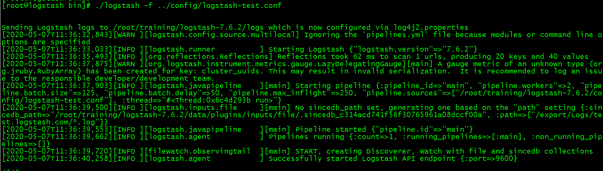

- [前言](#前言)
  * [logstash安装](#logstash安装--)
      - [下载logstash](#下载logstash)
      - [测试是否安装成功方法一](#测试是否安装成功方法一)
      - [测试是否安装成功方法二](#测试是否安装成功方法二)
  * [日志保存进Elasticsearch](#日志保存进Elasticsearch)
      - [终止进程](#终止进程)
      - [检测语法](#检测语法)
  * [Grok库](#grok库)

# 前言

>elk(`Elasticsearch`、 `Logstash`、 `Kibana`)搭建日志管理系统.

>Elasticsearch: 是一个实时的分布式搜索和分析引擎，它可以用于全文搜索，结构化搜索以及分析。它是一个建立在全文搜索引擎
>Apache Lucene 基础上的搜索引擎，使用 Java 语言编写。 

>Logstash: 是一个具有实时渠道能力的数据收集引擎。使用 JRuby 语言编写。其作者是世界著名的运维工程师乔丹西塞 (JordanSissel)。

>Kibana 是一款基于 Apache 开源协议，使用 JavaScript 语言编写，为 Elasticsearch 提供分析和可视化的 Web 
>平台。它可以在Elasticsearch 的索引中查找，交互数据，并生成各种维度的表图

> 通过`logstash`讲日志同步到`Elasticsearch`, 然后 `Kibana`对数据可视化展示。

## logstash安装

#### 下载logstash
- [下载logstash](https://www.elastic.co/cn/downloads/logstash)
- Version: 7.6.2

```bash
# 解压
tar -zxvf logstash-7.6.2.tar.gz -C /root/training/
```

#### 测试是否安装成功方法一
```bash
logstash -e 'input { stdin {} } output { stdout {} }'
```

- 输出如下内容代表已经安装成功了


#### 测试是否安装成功方法二
- 在 `/root/training/logstash-7.6.2/config` 目录复制配置文件修改成 `logstash-test.conf`
- 执行 `cp logstash-sample.conf logstash-test.conf`
- 修改内容如下， `output` 不写内容代表在控制台输出内容

```ruby
input {
  file {
        type => "log"
        path => "/export/Logs/test.logstash.com/*.log"
        start_position => "beginning"
  }
}

output {
     stdout {}
 }

```

- 进入bin目录 启动`logstash`服务

```bash
./logstash -f ../config/logstash-test.conf
```

- 输出如下内容代表安装成功


- 在 path地址内容写入日志内容

```bash
echo "test logstash" >> /export/Logs/test.logstash.com/test.log  
```

- 输出如下内容代表测试安装成功


## 日志保存进Elasticsearch 

- 配置示例：

```ruby

input {
  file {
        type => "log"
        path => "/export/Logs/logstash/*.log"
        start_position => "beginning"
  }
}

output {
  elasticsearch {
    codec => "json"   # 导出格式为json
    hosts => ["192.168.182.11:20019"]   
    index => "fwd_index_one"
    ## user => "xxxx"
    ## password => "xxxxxx"
  }
}

```

- `elasticsearch` 的 type 使用 `doc`
- `elasticsearch` 的 `mapping`配置示例：

```json

{
  "settings": {
    "index": {
      "number_of_shards": "4",
      "number_of_replicas": "1"
    }
  },
  "mappings": {
    "doc": {
      "properties": {
        "message": {
          "type": "text"
        }
      }
    }
  }
}

```

#### 终止进程

```bash
ps aux | grep logstash

kill -9  pid

```

#### 检测语法
```bash
./logstash -f ../config/logstash.conf -t

```

## Grok库
- http://grokdebug.herokuapp.com/   gropdebug在线
- 写了一个`NGINX`的切割`ACCESS`日志DEMO
```bash

#日志格式：

'$remote_addr - $remote_user [$time_local] "$http_x_forwarded_for" "$http_j_forwarded_for" '
                                                        '"$request" $status $bytes_sent '
                                                        '"$http_referer" "$http_user_agent" '
                                                        '"$gzip_ratio" "$host" "$http_x_original_to"';

#日志内容：
112.2.199.77 - - [11/May/2020:11:40:32 +0800] "112.2.199.177" "112.2.189.77" "GET / HTTP/1.1" 200 7978 "-" "Mozilla/5.0 (compatible; MSIE 9.0; Windows NT 6.1; WOW64; Trident/5.0)" "-" "bang.jd.com" "11.13.28.232"

#grop:
%{IPORHOST:clientip} %{USER:ident} %{USER:auth} \[%{HTTPDATE:logdate}\] "%{IPORHOST:http_x_forwarded_for}" "%{IPORHOST:http_j_forwarded_for}" "%{WORD:method} %{DATA:request} HTTP/%{NUMBER:httpversion}" %{NUMBER:response:int} (?:-|%{NUMBER:bytes:int}) %{QS:referrer} %{QS:agent} %{QS:gzip_ratio} "%{IPORHOST:host_name}" "%{IPORHOST:http_x_original_to}"

```

