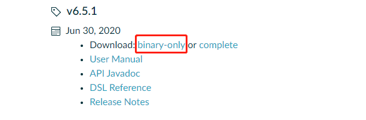
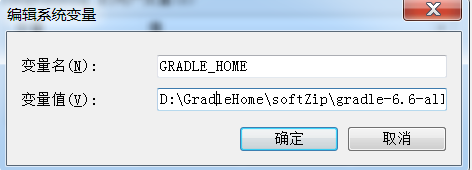
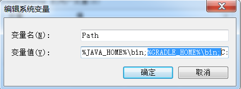

#简介
> 记录下gradle安装过程

### 下载gradle

- 官网下载地址： https://gradle.org/releases/

- 输出如下内容代表已经安装成功了


### 解压到本地

- Gradle 发行包是一个 ZIP 文件。完整的发行包包括以下内容(官方发行包有 full 完整版，也有不带源码和文档的版本，可根据需求下载。[Rover12421]译注):

- Gradle 可执行文件
- 用户手册 (有 PDF 和 HTML 两种版本)
- DSL 参考指南
- API 手册(Javadoc 和 Groovydoc)
- 样例，包括用户手册中的例子，一些完整的构建样例和更加复杂的构建脚本
- 源代码。仅供参考使用,如果你想要自己来编译 Gradle 你需要从源代码仓库中检出发行版本源码，具体请查看 Gradle 官方主页。

### 配置环境变量
1. 新增GRADLE_HOME环境变量



2. Path路径中新增： %GRADLE_HOME%\bin; 




### 测试

```shell

gradle -v

```


