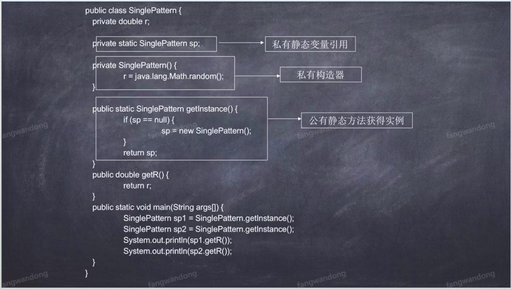

# 简介
> JAVA基础


## java运行命令
- java编译命令
- 编译之后生成HelloWorld.class文件

```bash

javac HelloWorld.java

```

- java运行命令

```bash
# 不要带.class后缀
java HelloWorld   

```

## java注释生产文档
#### 命令生成方式：
- 文档自动生成工具 javadoc
- 我们可以根据JavaAPI说明文档来看源码
- JAVA8在线API文档： https://www.matools.com/api/java8

```bash
javadoc HelloWorld.java
```

#### IDEA生成全部文档：
- IDEA位置： tools -> Generate JavaDoc 
- 配置生产文件路径
- 配置编码： -encoding UTF-8 -charset UTF-8
- 如下图所示


## 数据类型
- 一、简单数据类型：数值类型、字符型、布尔型
- 1、数值类型： 整数类型（byte、short、int、long） 浮点类型（float、dobule）
- 2、字符型： char
- 3、布尔型： boolen
- 二、引用数据类型： 类（class）、接口（interface）、 数组


## 面向对象
> 对象：

> 万事万物皆对象

> 面向对象方法的核心

> 具有明确的属性和行为

> 程序是对象的集合，通过消息互通。

> 类：

> 类是一类对象的属性和行为的抽象和总结

> 类描述同一类对象应包括的数据

> 类是一个概念模型

> 类是对象的模板，对象是类的实例


## 封装
- 概念：
 将类的某些信息隐藏在类的内部，不允许外部程序直接访问，
 而是通过该类提供的方法来实现对隐藏信息的操作和访问。
- 优点：
- 只能通过规定的方法访问数据
- 隐藏类的实例信息，方便修改和实现


## 继承


## 多态


## static
- 不变化里面的值，如果改变全局改变
- 访问属性： 类名.属性
- 访问方法： 类名.方法

## static初始化块
- static自由块只在类加载时执行一次，通常用于初始化静态资源
- static初始化块首先执行，在执行构造方法。

```java

public class TestStatic {

    public static int count = 0;

    public static int setStaticCount(){
        return count;
    }

    static {
        count = 14234;
        System.out.println("加载静态初始化块");
    }

    public TestStatic(){
        System.out.println("加载构造器");
    }
}


```

## 单例设计模式

- 一个类只能产生一个实例
- 实现方式： 创建一个类，构造器私有（private）
- 用一个私有（private）、静态（static）变量引用实例
- 提供一个公有的，静态方法获取实例。
- demo




## 包装类型和基本类型区别
