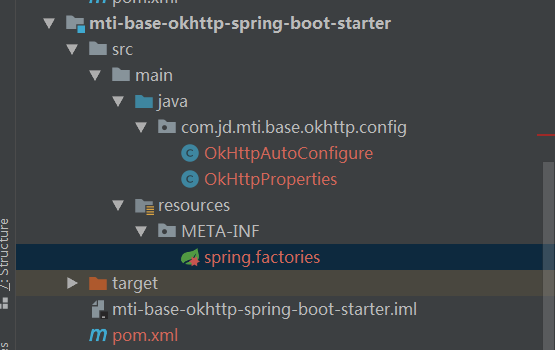

# 新增starter
- 最外层pom新增

```
            <dependency>
                <artifactId>mti-base-okhttp-spring-boot-starter</artifactId>
                <groupId>com.jd.mti.base</groupId>
                <version>${mti.base.version}</version>
            </dependency>

```

# 内部新增

- pom.xml 

```

<?xml version="1.0" encoding="UTF-8"?>

<project xmlns="http://maven.apache.org/POM/4.0.0" xmlns:xsi="http://www.w3.org/2001/XMLSchema-instance"
         xsi:schemaLocation="http://maven.apache.org/POM/4.0.0 http://maven.apache.org/xsd/maven-4.0.0.xsd">
    <parent>
        <artifactId>mti-base</artifactId>
        <groupId>com.jd.mti.base</groupId>
        <version>BASS-1.2.1-SNAPSHOT</version>
    </parent>
    <modelVersion>4.0.0</modelVersion>
    <artifactId>mti-base-okhttp-spring-boot-starter</artifactId>
    <name>mti-base-okhttp-spring-boot-starter</name>


    <properties>
        <project.build.sourceEncoding>UTF-8</project.build.sourceEncoding>
        <maven.compiler.source>1.7</maven.compiler.source>
        <maven.compiler.target>1.7</maven.compiler.target>
    </properties>

    <dependencies>
        <dependency>
            <groupId>com.jd.mti.base</groupId>
            <artifactId>mti-base-common</artifactId>
            <exclusions>
                <exclusion>
                    <groupId>ch.qos.logback</groupId>
                    <artifactId>logback-classic</artifactId>
                </exclusion>
            </exclusions>
        </dependency>
        <dependency>
            <groupId>org.springframework.boot</groupId>
            <artifactId>spring-boot-starter-log4j2</artifactId>
        </dependency>
        <dependency>
            <groupId>com.lmax</groupId>
            <artifactId>disruptor</artifactId>
        </dependency>
        <dependency>
            <groupId>org.springframework.boot</groupId>
            <artifactId>spring-boot-configuration-processor</artifactId>
            <optional>true</optional>
        </dependency>
    </dependencies>

    <build>
        <plugins>
            <plugin>
                <groupId>org.apache.maven.plugins</groupId>
                <artifactId>maven-source-plugin</artifactId>
                <executions>
                    <execution>
                        <id>attach-sources</id>
                        <goals>
                            <goal>jar</goal>
                        </goals>
                    </execution>
                </executions>
            </plugin>
        </plugins>
    </build>

</project>


```

java 代码

```Java 

package com.jd.mti.base.okhttp.config;

import lombok.Getter;
import lombok.Setter;
import lombok.ToString;
import lombok.experimental.Accessors;
import org.springframework.boot.context.properties.ConfigurationProperties;
import org.springframework.stereotype.Component;

/**
 * @author fangwandong@jd.com
 * @version 1.0
 * @date 2020-11-10 17:43
 **/

@Getter
@Setter
@Accessors(chain = true)
@ToString
@ConfigurationProperties(prefix = "mti.base.okhttp")
@Component
public class OkHttpProperties {

    private long timeout = 2000;

    private String MAX_REQUEST_PRE_HOST = "1000";

    private String url;

}


```

```
package com.jd.mti.base.okhttp.config;

import okhttp3.OkHttpClient;
import okhttp3.Request;
import okhttp3.Response;
import org.springframework.beans.factory.annotation.Autowired;
import org.springframework.boot.autoconfigure.condition.ConditionalOnWebApplication;
import org.springframework.boot.context.properties.EnableConfigurationProperties;
import org.springframework.context.annotation.Bean;
import org.springframework.context.annotation.Configuration;

import java.io.IOException;
import java.util.concurrent.TimeUnit;

/**
 * @author fangwandong@jd.com
 * @version 1.0
 * @date 2020-11-11 11:29
 **/
@Configuration
@EnableConfigurationProperties({OkHttpProperties.class})
@ConditionalOnWebApplication
public class OkHttpAutoConfigure {

    @Autowired
    private OkHttpProperties okHttpProperties;

    @Bean
    public String test() {
        Request request = new Request.Builder()
                .url(okHttpProperties.getUrl())
                .build();
        OkHttpClient client = new OkHttpClient().newBuilder()
                .connectTimeout(okHttpProperties.getTimeout(), TimeUnit.MILLISECONDS)
                .readTimeout(90L, TimeUnit.SECONDS)
                .build();

        //执行请求
        Response response = null;
        try {
            response = client.newCall(request).execute();
            //body只能执行一次，写到一个变量中使用
            return response.body().string();
        } catch (IOException e) {
            e.printStackTrace();
        }
        return null;
    }
}

````

```java 

org.springframework.boot.autoconfigure.EnableAutoConfiguration=com.jd.mti.base.okhttp.config.OkHttpAutoConfigure


```




idea配置
1. 同一个包路径
2. install 安装到本地
