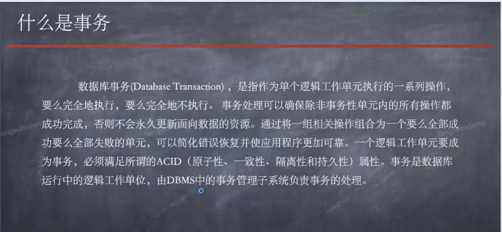
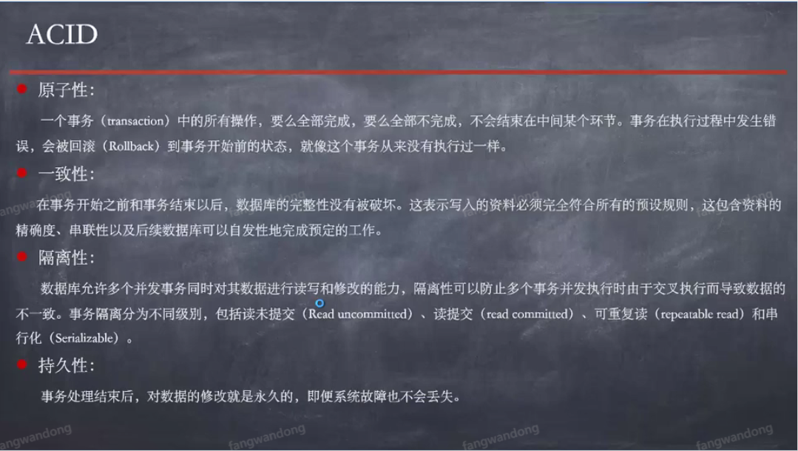

- [前言](#前言)
    + [sql语句](#sql语句)
    + [程序](#程序)

# 前言
>  事务处理金额demo

> 事务介绍



> ACID



### sql语句

```mysql

CREATE TABLE `spring_tx` (
  `id` int(11) unsigned NOT NULL AUTO_INCREMENT,
  `money` decimal(18,2) NOT NULL DEFAULT '0.00',
  `name` varchar(255) NOT NULL,
  PRIMARY KEY (`id`)
) ENGINE=InnoDB AUTO_INCREMENT=3 DEFAULT CHARSET=utf8

```

### 程序
**① 配置事务xml**

```xml

    <!--事务 -->
    <!-- https://mvnrepository.com/artifact/org.springframework/spring-tx -->
    <dependency>
      <groupId>org.springframework</groupId>
      <artifactId>spring-tx</artifactId>
      <version>4.3.18.RELEASE</version>
    </dependency>

```

**② 数据操作层DAO逻辑**

- 存入金额和扣减金额

```java
public class AccountDaoImpl extends JdbcDaoSupport implements AccountDao {
    @Override
    public void outMoney(String out, BigDecimal money) {
        String sql = "update spring_tx set money = money-? where name = ?";
        this.getJdbcTemplate().update(sql,money, out);
    }

    @Override
    public void intMoney(String in, BigDecimal money) {
        String sql = "update spring_tx set money = money+? where name = ?";
        this.getJdbcTemplate().update(sql,money,in);
    }
}

```

**③ 业务逻辑层**


```java

@Transactional(propagation = Propagation.REQUIRED,
        isolation = Isolation.DEFAULT,
        readOnly = false,
        rollbackFor = Exception.class)

public class AccoutServiceImpl implements AccountService {
    private AccountDao accountDao;

    public AccountDao getAccountDao() {
        return accountDao;
    }

    public void setAccountDao(AccountDao accountDao) {
        this.accountDao = accountDao;
    }

    @Override
    public void transfer(String out, String in, BigDecimal money) {
        accountDao.intMoney(in, money);
        accountDao.outMoney(out, money);
    }
}

```

**④ applicationContex-trns.xml配置**

```xml

    <bean id="datasource" class="org.springframework.jdbc.datasource.DriverManagerDataSource">
        <property name="driverClassName" value="com.mysql.jdbc.Driver"/>
        <property name="url" value="jdbc:mysql://192.168.229.100/springjdbc"/>
        <property name="username" value="root"/>
        <property name="password" value="123456"/>
    </bean>

    <!--配置业务类-->
    <bean id="accoutService" class="com.jd.trans.AccoutServiceImpl">
        <property name="accountDao" ref="accountDao" />
    </bean>

    <!--配置Dao类-->
    <bean id="accountDao" class="com.jd.trans.AccountDaoImpl">
        <property name="dataSource" ref="datasource" />
    </bean>


    <!--设置事务操作类-->
    <bean id="dataSourceTransactionManager" class="org.springframework.jdbc.datasource.DataSourceTransactionManager">
        <property name="dataSource" ref="datasource" />
    </bean>

    <!--开启事务注解-->
    <tx:annotation-driven transaction-manager="dataSourceTransactionManager"/>

```

**⑤ 运行类**

```java

public class TransTun {
    public static void main(String[] args) {
        ApplicationContext app = new ClassPathXmlApplicationContext("applicationContext-trns.xml");
        AccountService accountService = (AccountService) app.getBean("accoutService");
        accountService.transfer("zs", "ls", BigDecimal.valueOf(10.999));
    }

```