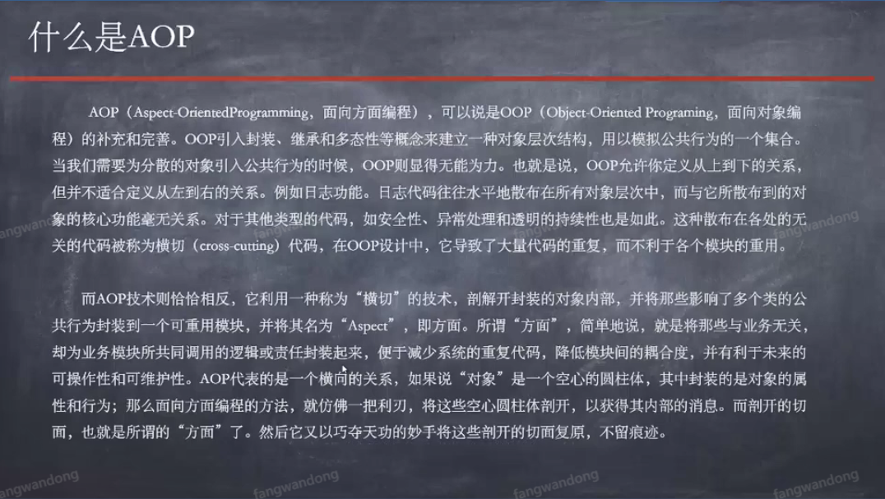

- [前言](#前言)
  * [XML配置AOP](#XML配置AOP)
  * [注解配置AOP](#注解配置AOP)
  * [总结](#总结)

# 前言
> AOP面向切面，使用业务场景：日志、监控。开关事务的操作、开关资源的操作。
> 在某个方法前面或者后面对功能进行扩充。



## XML配置AOP

**① 引入AOP相关的jar**
- spring aop
- spring aspects
```xml

    <!--AOP相关JAR-->

    <!-- https://mvnrepository.com/artifact/org.springframework/spring-aop -->
    <dependency>
      <groupId>org.springframework</groupId>
      <artifactId>spring-aop</artifactId>
      <version>4.3.18.RELEASE</version>
    </dependency>

    <!-- https://mvnrepository.com/artifact/org.springframework/spring-aspects -->
    <dependency>
      <groupId>org.springframework</groupId>
      <artifactId>spring-aspects</artifactId>
      <version>4.3.18.RELEASE</version>
    </dependency>

```

**② 创建测试类**
- UserDao类 有save方法

```java 
public class UserDao implements IUserDao{

    @Override
    public void save() {
        System.out.println("=====userDao已经保存！======");
    }
}

```
- OrderDao类，同样有save方法

```java
public class OrderDao {

    public void save() {
        System.out.println("======orderDao已经保存=====");
    }
}

```

**③ 创建被切入方法AOP类，begin、after方法

```java

public class Aop {

    public void begin(){
        System.out.println("====AOP切入功能1====");
    }

    public void after(){
        System.out.println("====AOP切入功能2====");
    }
}

```

**④ xml配置：重点**

```xml

    <!--注册目标对象-->
    <bean id="userDao" class="com.jd.springaop.springaopxml.UserDao"/>
    <bean id="orderDao" class="com.jd.springaop.springaopxml.OrderDao"/>

    <!--注册被切入的方法的提供者-->
    <bean id="aop" class="com.jd.springaop.springaopxml.Aop"/>

    <!--
    pointcut: 切入点。
    expression： 配置要切入的地方. execution(* com.jd.springaop.springaopxml.*)
    .*(..) : 代表参数
    begin： 在方法之前切入
    after：在方法之后切入
    -->
    <aop:config>
        <aop:pointcut id="cut" expression="execution(* com.jd.springaop.springaopxml.*.*(..))"/>
        <aop:aspect ref="aop">
            <aop:before method="begin" pointcut-ref="cut"/>
            <aop:after method="after" pointcut-ref="cut"/>
        </aop:aspect>
    </aop:config>

```

**⑤ 运行类**

```java

public class SpringAopXmlRun {
    public static void main(String[] args) {
        ApplicationContext app = new ClassPathXmlApplicationContext("applicationContext-aop-xml.xml");
        IUserDao user = (IUserDao) app.getBean("userDao");
        user.save();

        System.out.println("=======华丽的分割线=======");

        OrderDao order = (OrderDao) app.getBean("orderDao");
        user.save();
    }
}


/*
//输出

====AOP切入功能1====
=====userDao已经保存！======
====AOP切入功能2====
=======华丽的分割线=======
====AOP切入功能1====
=====userDao已经保存！======
====AOP切入功能2====
 */

```


## 注解配置AOP
**① 引入AOP相关的jar, 同xml配置AOP一样**

**② UserDao接口实现类标记`@Component` 标注成Bean**

```java

@Component
public class UserDao implements IUserDao {

    @Override
    public void save() {
        System.out.println("-----------userDao已经保存！-----------");
    }
}

```

**③ 无接口的类被代理需要设置prototype**

```java
@Component
@Scope("prototype") //无接口的类被代理需要设置prototype
public class OrderDao {

    public void save() {
        System.out.println("----------orderDao已经保存------------");
    }
}

```


**④ Aop类使用注解形式，配置切入点**

```java

@Component
@Aspect  //声明AOP类作为切面类存在
public class Aop {

    //设置切入规则方法，配置成切入点
    @Pointcut("execution(* com.jd.springaop.springaopanno.*.*(..))")
    public void pointCut(){
    }

    @Before("pointCut()")
    public void begin(){
        System.out.println("---------Aop begin 注入功能模块1");
    }

    @After("pointCut()")
    public void after(){
        System.out.println("---------Aop after 注入功能模块2");
    }
}

```


**⑤ xml配置变的简单多了**

```xml

    <!--开启扫描注解, 不需要配置XML -->
    <context:component-scan base-package="com.jd.springaop.springaopanno"/>

    <!--开启AOP功能注解-->
    <aop:aspectj-autoproxy />

```

**⑥ 运行类**

```java


public class SpringAopAnnoRun {

    public static void main(String[] args) {
        ApplicationContext app = new ClassPathXmlApplicationContext("applicationContext-aop-anno.xml");
        IUserDao user = (IUserDao) app.getBean("userDao");
        user.save();

        System.out.println("=====================");

        OrderDao order = (OrderDao) app.getBean("orderDao");
        order.save();

    }
}

//输出

/*

---------Aop begin 注入功能模块1
-----------userDao已经保存！-----------
---------Aop after 注入功能模块2
=====================
---------Aop begin 注入功能模块1
----------orderDao已经保存------------
---------Aop after 注入功能模块2

*/

```


## 总结
1. 静态代理： 非常局限，只能给特定（自己定义的）接口实现类代理。
2. 动态代理： 比较灵活，可以给具有接口类进行代理。
3. AOP： 灵活、可以给任意（UserDao有接口/OrderDao无接口）类代理。