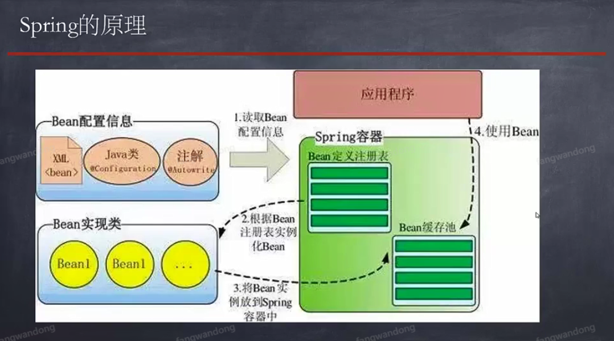
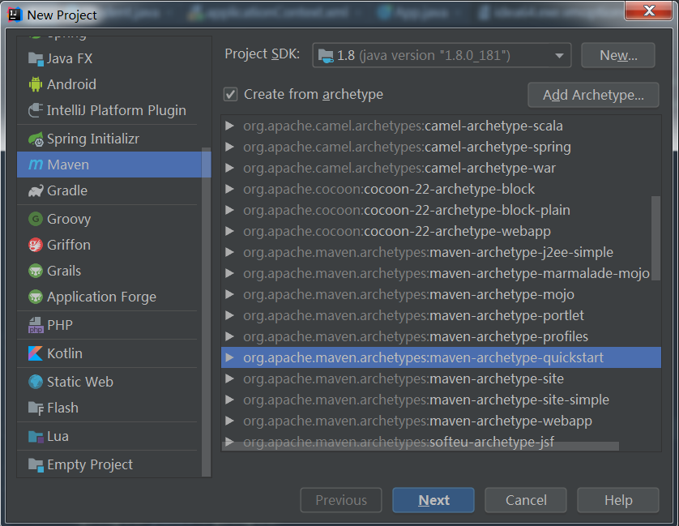
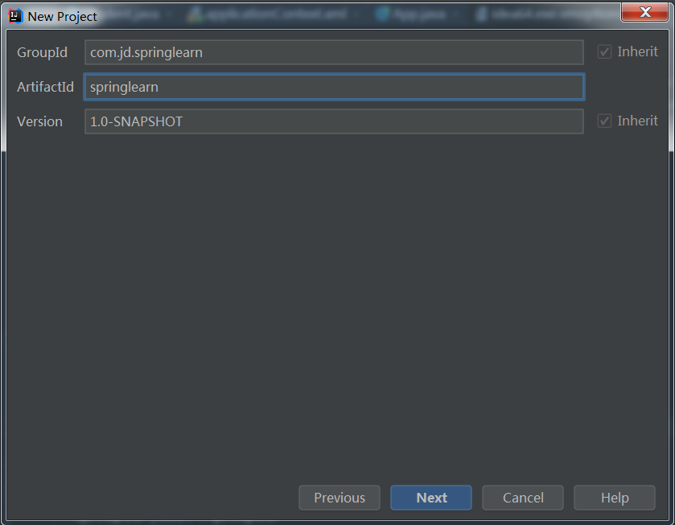
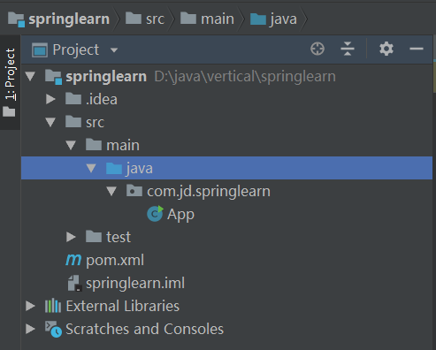

# 前言
>对spring基础整理，spring框架介绍、spring原理、spring使用，文章都是实际操作所写，绝非水文。

## spring框架 

### spring的介绍
- spring是一个轻量级的开源框架
- 作用：1、降低层与层之间的耦合度。 2、大大提高了开发效率，减少了代码的硬编码。
- 简单框架最少满足四层：视图层、实体层、业务逻辑层、数据访问层


### spring的原理
- 传统实例化对象方式：new实例化对象，是一种硬编码实行，类的调用依赖性太强，代码粘合度很高。也代表我们通过实例化创建出这个对象之后，很难在进行更改

- spring的工作原理： 在开发过程当中帮大家降低实例化的操作。大大提高了开发人员在项目中获取对象的过程。

- spring通过特定xml信息，Bean容器读取xml信息（Bean定义注册表），把所有的应用程序对象都实例化。
使用对象的时候，去Bean缓存池中取对象即可。 说白了把所有的对象都交给Bean容器去管理。



### spring的使用

##### IDEA创建Maven工程
- Maven是项目管理工具，也是一个项目构建工具。
- 特点：1、jar集中交给Maven管理。 2、中央仓库（https://mvnrepository.com/），存放市面上流行的框架jar


##### Maven工程集成Spring

**① 创建项目**


- 选择Maven来创建项目


- groupid: 工作组（package名）
- Artifactid： 项目名称




- pom： maven管理jar包的配置文件。
- src： java类的存放地址




**② pom文件中引入sping依赖**

1. `spring-context`
2. `sping-core`
3. `spring-beans`

```xml

    <!--spring相关的依赖-->
    <!-- https://mvnrepository.com/artifact/org.springframework/spring-context -->
    <dependency>
      <groupId>org.springframework</groupId>
      <artifactId>spring-context</artifactId>
      <version>4.3.18.RELEASE</version>
    </dependency>

    <!-- https://mvnrepository.com/artifact/org.springframework/spring-core -->
    <dependency>
      <groupId>org.springframework</groupId>
      <artifactId>spring-core</artifactId>
      <version>4.3.18.RELEASE</version>
    </dependency>

    <!-- https://mvnrepository.com/artifact/org.springframework/spring-beans -->
    <dependency>
      <groupId>org.springframework</groupId>
      <artifactId>spring-beans</artifactId>
      <version>4.3.18.RELEASE</version>
    </dependency>

```

**③ 设置Spring配置文件(管理对象)**
创建`resources`目录，标记为资源。新增`applicationContext.xml`
- 注意：
1. 需要设定java为工作目录（蓝色）
2. 创建resources文件夹（作为资源目录）
3. spring可以接管项目中对象（如何对项目中对象管理：Bean，参考Spring容器Bean介绍）

```xml

<?xml version="1.0" encoding="UTF-8"?>
<beans xmlns="http://www.springframework.org/schema/beans"
       xmlns:xsi="http://www.w3.org/2001/XMLSchema-instance"
       xsi:schemaLocation="http://www.springframework.org/schema/beans
       http://www.springframework.org/schema/beans/spring-beans.xsd">

    <!--在spring注册bean对象-->
    <!--
    id: 创建对象的名称
    class：类的包路径
    含义：Spring会实例化com.jd.domain.Student对象，对象名称叫 myStudent
    -->
    <bean id="myStudent" class="com.jd.domain.Student"/>

</beans>


```


**④读取Spring的配置文件**

1. 运行之后，发现不用实例化就输出构造函数打印的数据

```java

public class App
{
    public static void main( String[] args )
    {
        ApplicationContext applicationContext =
                new ClassPathXmlApplicationContext("applicationContext.xml");
        applicationContext.getBean("myStudent");
    }
}

```

##### Spring容器Bean介绍
- Bean种类：pojo对象 ---> servlet(JSP):javaBean --->Bean

- 什么条件下称之为Bean？

1. 属性
2. 封装（getter和setter）
3. 无参构造方法
例如以下demo:

```java

package com.jd.domain;

/**
 * student
 *
 * @author fangwandong@jd.com
 * @version 1.0  2020-06-20 11:29
 **/

public class Student {
    private String name;
    private int age;

    public String getName() {
        return name;
    }

    public void setName(String name) {
        this.name = name;
    }

    public int getAge() {
        return age;
    }

    public void setAge(int age) {
        this.age = age;
    }

    @Override
    public String toString() {
        return "Student{" +
                "name='" + name + '\'' +
                ", age=" + age +
                '}';
    }

    public Student() {
        System.out.println("我是一个学生!!");
    }
}

```

#### 总结
1. 如果`Spring`接管项目中对象，`Spring`框架在启动时会读取配置在`applicationContext.xml`配置文件中的Bean对象进行实例化，方便调用这调用。
2. Bean特点：作用域 

```xml
<!-- 1、singleton： 单例模式， 在整个Spring容器中无论何处调用只有一个对象生成；  -->
<bean id="myStudent" class="com.jd.domain.Student" scope="singleton"/>

```

```java

public class App
{
    public static void main( String[] args )
    {
        ApplicationContext applicationContext =
                new ClassPathXmlApplicationContext("applicationContext.xml");
        Student student = (Student) applicationContext.getBean("myStudent");
        System.out.println(student.getName());

        Student student1 = (Student) applicationContext.getBean("myStudent");
        System.out.println(student == student1);  //true
    }
}

```


```xml
<!-- 2、prototype：原型模式，每次通过getBean获取bean对象时候，都将产生一个新的Bean实例。  -->
<bean id="myStudent" class="com.jd.domain.Student" scope="singleton"/>

```


```java

public class App
{
    public static void main( String[] args )
    {
        ApplicationContext applicationContext =
                new ClassPathXmlApplicationContext("applicationContext.xml");
        Student student = (Student) applicationContext.getBean("myStudent");
        System.out.println(student.getName());

        Student student1 = (Student) applicationContext.getBean("myStudent");
        System.out.println(student == student1);  //false
    }
}

```


