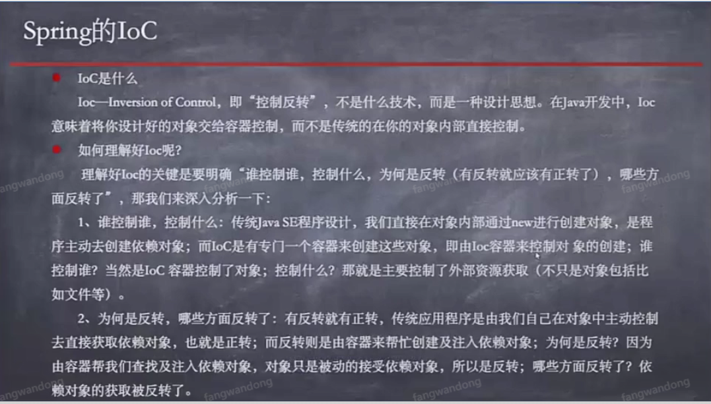

- [前言](#--)
  * [Spring的Ioc](#Spring的Ioc)
  * [Spring的DI](#spring的di)
  * [配置依赖（注入数据）](#配置依赖（注入数据）)
      - [Setter注入](#Setter注入)
      - [构造注入](#构造注入)
      - [配置合并Bean（注入Bean）](#配置合并Bean（注入Bean）)
      - [自动装配注入](#自动装配注入)
      - [注入复杂数据(List类型)](#注入复杂数据(List类型))
      - [注解注入](#注解注入)

# 前言
> 主要记录Spring框架相关 Ioc和DI，以及相关的实操代码。

## Spring的Ioc
- Ioc—Inversion of Control，即“控制反转”，不是什么技术，而是一种设计思想。
- 将Spring作为bean对象容器，将来所有bean的创建及销毁均由Spring控制，控制权由开发人员转向Spring接管。




## Spring的DI
- DI—Dependency Injection，即“依赖注入”：是组件之间依赖关系由容器在运行期决定，形象的说，即由容器动态的将某个依赖关系注入到组件之中。
- Spring容器中管理的Bean所需要的数据通过DI实现注入。


## 配置依赖（注入数据）
#### Setter注入
```xml

    <!-- property name属性和Teacher类中set方法对象 name: setName -->
    <bean id="myTeacher" class="com.jd.beanioc.Teacher">
        <property name="name" value="方老师"/>
        <property name="address" value="北京市大兴区" />
        <property name="phone" value="138383883"/>
    </bean>

```

- Teacher类
```java

package com.jd.beanioc;

/**
 * 老师类
 *
 * @author fangwandong@jd.com
 * @version 1.0  2020-06-20 16:31
 **/

public class Teacher {
    private String name;
    private String address;
    private String phone;

    public String getName() {
        return name;
    }

    public void setName(String name) {
        this.name = name;
    }

    public String getAddress() {
        return address;
    }

    public void setAddress(String address) {
        this.address = address;
    }

    public String getPhone() {
        return phone;
    }

    public void setPhone(String phone) {
        this.phone = phone;
    }

    @Override
    public String toString() {
        return "Teacher{" +
                "name='" + name + '\'' +
                ", address='" + address + '\'' +
                ", phone='" + phone + '\'' +
                '}';
    }

    public Teacher() {
        System.out.println("我是一个老师！！");
    }
}


```

#### 构造注入
- Spring容器中接管的Bean，会在Spring容器启动时被实例化。
- 利用构造方法，给Bean实例进行数据注入(分为隐性注入构造函数、显性注入构造函数：实现效果是一样的)。

- 注意：
1. constructor-arg 个数根据构造方法个数一致
2. 隐性注入：必须保持顺序一致。 显性注入：设置顺序任意。

- applicationContext.xml 内容如下：

```xml

    <bean id="myDog" class="com.jd.beanioc.Dog">
        <!--隐性注入构造函数-->
<!--    <constructor-arg index="0" value="哈士奇" />
        <constructor-arg index="1" value="5"/>
        <constructor-arg index="2" value="白色"/>-->

        <!--显性注入构造函数-->
        <constructor-arg name="name" value="泰迪"/>
        <constructor-arg name="age" value="4"/>
        <constructor-arg name="color" value="灰色"/>
    </bean>

```

- Dog类

```java
package com.jd.beanioc;

/**
 * dog
 *
 * @author fangwandong@jd.com
 * @version 1.0  2020-06-20 17:16
 **/

public class Dog {
    private String name;
    private String age;
    private String color;

    public String getName() {
        return name;
    }

    public void setName(String name) {
        this.name = name;
    }

    public String getAge() {
        return age;
    }

    public void setAge(String age) {
        this.age = age;
    }

    public String getColor() {
        return color;
    }

    public void setColor(String color) {
        this.color = color;
    }

    @Override
    public String toString() {
        return "Dog{" +
                "name='" + name + '\'' +
                ", age='" + age + '\'' +
                ", color='" + color + '\'' +
                '}';
    }

    public Dog(String name, String age, String color) {
        this.name = name;
        this.age = age;
        this.color = color;
    }
}

```

- 运行类

```java

public class SpringIocDog {

    public static void main(String[] args) {
        ApplicationContext applicationContext =
                new ClassPathXmlApplicationContext("applicationContext.xml");
        Dog dog = (Dog) applicationContext.getBean("myDog");
        System.out.println(dog);
    }
}

```


#### 配置合并Bean（注入Bean）

```xml

    <!-- dog的bean，合并到teacher中 -->
    <bean id="myTeacher" class="com.jd.beanioc.Teacher">
        <property name="name" value="方老师"/>
        <property name="address" value="北京市大兴区" />
        <property name="phone" value="138383883"/>
        <property name="dog" ref="myDog" />
    </bean>
    <bean id="myDog" class="com.jd.beanioc.Dog">
        <constructor-arg name="name" value="泰迪"/>
        <constructor-arg name="age" value="4"/>
        <constructor-arg name="color" value="灰色"/>
    </bean>

```

- Teacher类，dog作为Teacher的一个属性。老师养一条狗。

```java
package com.jd.beanioc;

/**
 * 老师类
 *
 * @author fangwandong@jd.com
 * @version 1.0  2020-06-20 16:31
 **/

public class Teacher {
    private String name;
    private String address;
    private String phone;
    private Dog dog;

    public Dog getDog() {
        return dog;
    }

    public void setDog(Dog dog) {
        this.dog = dog;
    }


    public String getName() {
        return name;
    }

    public void setName(String name) {
        this.name = name;
    }

    public String getAddress() {
        return address;
    }

    public void setAddress(String address) {
        this.address = address;
    }

    public String getPhone() {
        return phone;
    }

    public void setPhone(String phone) {
        this.phone = phone;
    }

    @Override
    public String toString() {
        return "Teacher{" +
                "name='" + name + '\'' +
                ", address='" + address + '\'' +
                ", phone='" + phone + '\'' +
                ", dog=" + dog +
                '}';
    }

    public Teacher() {
        System.out.println("我是一个老师！！");
    }

    public Teacher(String name, String address, String phone) {
        this.name = name;
        this.address = address;
        this.phone = phone;
    }
}

```


#### 自动装配注入
- `autowire="byName"` 自动注入，通过名字进行注入, `dog`名称对应`Teacher`属性`dog`的名称。

```xml
    <bean id="myTeacher" class="com.jd.beanioc.Teacher" autowire="byName">
        <property name="name" value="方老师"/>
        <property name="address" value="北京市大兴区" />
        <property name="phone" value="138383883"/>
       <!-- <property name="dog" ref="myDog" />-->
    </bean>
    <bean id="dog" class="com.jd.beanioc.Dog">
        <constructor-arg name="name" value="泰迪"/>
        <constructor-arg name="age" value="4"/>
        <constructor-arg name="color" value="灰色"/>
    </bean>

```
- `autowire="byType"` 通过类型自动注入，名称可以随便写。

```xml

    <bean id="myTeacher" class="com.jd.beanioc.Teacher" autowire="byType">
        <property name="name" value="方老师"/>
        <property name="address" value="北京市大兴区" />
        <property name="phone" value="138383883"/>
       <!-- <property name="dog" ref="myDog" />-->
    </bean>
    <bean id="cat" class="com.jd.beanioc.Dog">
        <constructor-arg name="name" value="泰迪"/>
        <constructor-arg name="age" value="4"/>
        <constructor-arg name="color" value="灰色"/>
    </bean>

```

#### 注入复杂数据(List类型)

```xml

    <bean id="myTeacher" class="com.jd.beanioc.Teacher" autowire="byType">
        <property name="name" value="方老师"/>
        <property name="address" value="北京市大兴区" />
        <property name="phone" value="138383883"/>
        <property name="schools">
            <list>
                <value>小学</value>
                <value>大学</value>
            </list>
        </property>
    </bean>
    <bean id="cat" class="com.jd.beanioc.Dog">
        <constructor-arg name="name" value="泰迪"/>
        <constructor-arg name="age" value="4"/>
        <constructor-arg name="color" value="灰色"/>
        <constructor-arg name="kennel">
            <list>
                <value>房间狗窝</value>
                <value>树下狗窝</value>
            </list>
        </constructor-arg>
    </bean>

```

- Teacher类新增List类型
```java

 private List<String> schools;

    public List<String> getSchools() {
        return schools;
    }

    public void setSchools(List<String> schools) {
        this.schools = schools;
    }

```

- dog类新增狗窝类

```java
    private List<String> kennel;

    public List<String> getKennel() {
        return kennel;
    }

    public void setKennel(List<String> kennel) {
        this.kennel = kennel;
    }

```

#### 注解注入

```xml

    <!--开启注解配置自动扫描带有注解的类进行Spring容器接管，从而实现DI-->
    <context:annotation-config/>
    <!-- 组件扫描 -->
    <context:component-scan base-package="com.jd.beanioc"/>

```

- Teacher类：新增`@Component(value = "teacher")`, dog类通过 `@Autowired` 注解标识进行扫描，实现DI注入。
- `@Autowired` 是一个注释，它可以对类成员变量、方法及构造函数进行标注，让 spring 完成 bean 自动装配的工作。

```java
/**
 * 老师类
 *
 * @author fangwandong@jd.com
 * @version 1.0  2020-06-20 16:31
 **/

@Component(value = "teacher")
public class Teacher {
    private String name;
    private String address;
    private String phone;

    @Autowired
    private Dog dog;

    private List<String> schools;

    public String getName() {
        return name;
    }

    public void setName(String name) {
        this.name = name;
    }

    public String getAddress() {
        return address;
    }

    public void setAddress(String address) {
        this.address = address;
    }

    public String getPhone() {
        return phone;
    }

    public void setPhone(String phone) {
        this.phone = phone;
    }

    public Dog getDog() {
        return dog;
    }

    public void setDog(Dog dog) {
        this.dog = dog;
    }

    public List<String> getSchools() {
        return schools;
    }

    public void setSchools(List<String> schools) {
        this.schools = schools;
    }

    @Override
    public String toString() {
        return "Teacher{" +
                "name='" + name + '\'' +
                ", address='" + address + '\'' +
                ", phone='" + phone + '\'' +
                ", dog=" + dog +
                ", schools=" + schools +
                '}';
    }

    public Teacher(String name, String address, String phone, List<String> schools) {
        this.name = name;
        this.address = address;
        this.phone = phone;
        this.schools = schools;
    }

    public Teacher() {
    }

```
- dog类: 新增 `@Component`: 注册bean

```java
/**
 * dog
 *
 * @author fangwandong@jd.com
 * @version 1.0  2020-06-20 17:16
 **/

@Component
public class Dog {
    private String name = "旺财";
    private String age = "55";
    private String color = "彩色";
    private List<String> kennel;

    public String getName() {
        return name;
    }

    public void setName(String name) {
        this.name = name;
    }

    public String getAge() {
        return age;
    }

    public void setAge(String age) {
        this.age = age;
    }

    public String getColor() {
        return color;
    }

    public void setColor(String color) {
        this.color = color;
    }

    public List<String> getKennel() {
        return kennel;
    }

    public void setKennel(List<String> kennel) {
        this.kennel = kennel;
    }

    @Override
    public String toString() {
        return "Dog{" +
                "name='" + name + '\'' +
                ", age='" + age + '\'' +
                ", color='" + color + '\'' +
                ", kennel=" + kennel +
                '}';
    }

    public Dog(String name, String age, String color, List<String> kennel) {
        this.name = name;
        this.age = age;
        this.color = color;
        this.kennel = kennel;
    }

    public Dog() {
    }
}


```

- 运行类：

```java

public class SpringIocRun {
    public static void main(String[] args) {
        ApplicationContext applicationContext =
                new ClassPathXmlApplicationContext("applicationContext.xml");
        //配置了Teacher类的id，通过id获取
        Teacher teacher = (Teacher) applicationContext.getBean("teacher");
        System.out.println(teacher);
    }
}

```