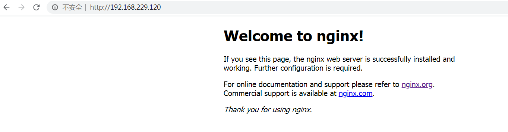

# 前言

#### nginx安装
**① 下载Nginx 下载地址：http://nginx.org/download/nginx-1.8.0.tar.gz**

```bash
#下载
wget http://nginx.org/download/nginx-1.8.0.tar.gz

#解压
tar -zxvf  nginx-1.8.0.tar.gz

```

**② 编译nginx和安装; `prefix`： 指定安装路径**

```bash
cd nginx-1.8.0

./configure --prefix=/usr/local/nginx --with-http_stub_status_module --with-http_ssl_module --with-http_realip_module --with-http_sub_module --with-http_gzip_static_module

make && make install 

```

**③ 浏览器测试是否安装成功**




**④ 修改nginx配置文件如下**

```nginx

user  www www;
worker_processes  2;

events {
    worker_connections  1024;
}


http {
    include       mime.types;
    default_type  application/octet-stream;

    log_format  main  '$remote_addr - $remote_user [$time_local] "$request" '
                      '$status $body_bytes_sent "$http_referer" '
                      '"$http_user_agent" "$http_x_forwarded_for"';

    access_log  logs/access.log  main;

    sendfile        on;
    #tcp_nopush     on;

    #keepalive_timeout  0;
    keepalive_timeout  65;

    #gzip  on;

    server {
        listen       80;
        server_name  localhost;

        charset utf-8;

        #access_log  logs/host.access.log  main;
        #nginx欢迎页入口
        location / {
            root html;
            index  index.html index.htm;
            try_files $uri  $uri/ /index.php?$query_string;
        }

        #error_page  404              /404.html;

        # redirect server error pages to the static page /50x.html
        #
        error_page   500 502 503 504  /50x.html;
        location = /50x.html {
            root   html;
        }

        # proxy the PHP scripts to Apache listening on 127.0.0.1:80
        #
        #location ~ \.php$ {
        #    proxy_pass   http://127.0.0.1;
        #}

        # pass the PHP scripts to FastCGI server listening on 127.0.0.1:9000
        #
        location ~ \.php$ {
            fastcgi_pass   unix:/var/run/php-fpm.sock;
            fastcgi_index  index.php;
            fastcgi_param  SCRIPT_FILENAME  $document_root$fastcgi_script_name;
            include        fastcgi_params;
        }
    }

    include /mnt/hgfs/www/php-domain/101/*.conf;

}

```


#### nginx和php关联配置
**① 配置nginx.conf文件，启动php-fpm**

```nginx

# nginx.conf配置

location ~ \.php$ {
    fastcgi_pass   unix:/var/run/php-fpm.sock;
    fastcgi_index  index.php;
    fastcgi_param  SCRIPT_FILENAME  $document_root$fastcgi_script_name;
    include        fastcgi_params;
}

```
**② 以下两个配置必须一致才行**

```nginx

php-fpm.conf: listen = /var/run/php-fpm.sock;
nginx.conf: fastcgi_pass unix:/var/run/php-fpm.sock;

```

#### configure文件详解
- 待更新


#### Nginx设置变量
**① 使用`set`命令**

```bash
set $a hello

```

#### nginx关于uri的变量
**① 在nginx中有几个关于uri的变量,包括$uri $request_uri $document_uri，下面看一下他们的区别：**

```bash
 $request_uri: /stat.php?id=1585378&web_id=1585378
 $uri /stat.php
 $document_uri: /stat.php
 $args #这个变量等于请求行中的参数。
 $content_length #请求头中的Content-length字段。
 $content_type #请求头中的Content-Type字段。
 $document_root #当前请求在root指令中指定的值。
 $host #请求主机头字段，否则为服务器名称。
 $http_user_agent #客户端agent信息
 $http_cookie #客户端cookie信息
 $limit_rate #这个变量可以限制连接速率。
 $request_body_file #客户端请求主体信息的临时文件名。
 $request_method #客户端请求的动作，通常为GET或POST。
 $remote_addr #客户端的IP地址。
 $remote_port #客户端的端口。
 $remote_user #已经经过Auth Basic Module验证的用户名。
 $request_filename #当前请求的文件路径，由root或alias指令与URI请求生成。
 $query_string #与$args相同。
 $scheme #HTTP方法（如http，https）。
 $server_protocol #请求使用的协议，通常是HTTP/1.0或HTTP/1.1。
 $server_addr #服务器地址，在完成一次系统调用后可以确定这个值。
 $server_name #服务器名称。
 $server_port #请求到达服务器的端口号。
 $request_uri #包含请求参数的原始URI，不包含主机名，如：”/foo/bar.php?arg=baz”。
 $uri #不带请求参数的当前URI，$uri不包含主机名，如”/foo/bar.html”。
 $document_uri #与$uri相同。

```
#### nginx限流和添加自定义header头
**①在server之上新增限流**

**②使用 add_header X-uri-aaa "$uri"; 添加自定义header头和打印变量**

```nginx
upstream test_jd {
    server  test.jd.com weight=10 max_fails=2 fail_timeout=30s;
}

#加限流策略 ip限流(内网服务不限流)
map $host $ip_limit {
    default $binary_remote_addr;
    "test.jd.com" "";
}
#单ip 限制qps<=50
limit_req_zone $ip_limit  zone=ip_limit_zone:100m rate=50r/s;
limit_req_log_level warn;
limit_req_status 503;
limit_req zone=ip_limit_zone burst=5 nodelay;

server {
    listen 80;
    server_name test.jd.com;

    #ssi on;
    #ssi_last_modified on
    #ssi_silent_errors on;
    #ssi_types text/html;

    #access_log               /home/wwwlogs/test_access.log main;
    error_log                /home/wwwlogs/test_error.log warn;

    root   /mnt/hgfs/www/test;
    location / {
        index  index.html index.htm  index.php;
    }

    location ~* "/try/index.php" {
        proxy_pass http://test_jd;
    }

    error_page   500 502 503 504  /50x.html;
    location = /50x.html {
        root   html;
    }

    location ~ \.php($|/) {

        add_header X-uri-aaa "$uri";
        add_header HOST-name "$limit_rate";
        fastcgi_pass   unix:/var/run/php-fpm.sock;
        fastcgi_index index.php;
        fastcgi_param SCRIPT_FILENAME /mnt/hgfs/www/test$fastcgi_script_name;
        include  fastcgi_params;
    }

}


```


#### location语法详解

https://juejin.im/post/5ce5e1f65188254159084141


#### Nginx安装echo模块
**① 使用 `echo-nginx-module` 模块可以在Nginx中用来输出一些信息，可以用来实现简单接口或者排错。**

```bash

wget https://github.com/openresty/echo-nginx-module/archive/v0.61.tar.gz


cd /root/training/nginx-1.8.0/

./configure --prefix=/usr/local/nginx --with-http_stub_status_module --with-http_ssl_module --with-http_realip_module --with-http_sub_module --with-http_gzip_static_module  --add-module=/root/training/echo-nginx-module-0.61

make && make install

```
**② 在 `/usr/local/nginx/conf/nginx.conf`中 `server`中新增**

```nginx

location /hello { 
    default_type 'text/plain';
    return 200 'hello!';
}

location /hello_echo { 
    default_type 'text/plain'; 
    echo "hello, echo!";
}

``` 

**③ 注意：重新编译 Nginx二进制，Nginx需要停止重启。而普通配置更新则 `reload` 即可：**

```nginx

$ kill -QUIT `cat /usr/local/nginx/logs/nginx.pid` && /usr/local/nginx/sbin/nginx

```


**④ 如果支持 `service nginx restart`，则可以这样重新启动：**

```bash

$ service nginx restart && /usr/local/nginx/sbin/nginx -s reload

```

**⑤ 然后`curl`测试：**

```bash

$ curl http://127.0.0.1/hello
hello!

$ curl http://127.0.0.1/hello_echo
hello, echo!

```

- 当然， echo-nginx-module 模块不仅仅是提供echo这么简单的指令，还有其它的指令，
- 详见：https://github.com/openresty/echo-nginx-module#content-handler-directives
- echo模块参考： https://www.cnblogs.com/52fhy/p/10166333.html
- 后续更新，nginx限流原理，nginx源码解析
- 限流参考： https://www.cnblogs.com/biglittleant/p/8979915.html
